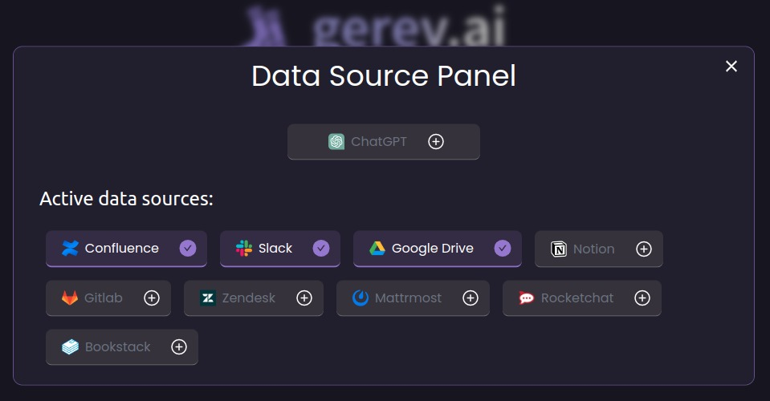

## Join Discord for early access code!

  

   [Join here!](https://discord.gg/NKhTX7JZAF)
  
# **New!** 🎉 ChatGPT plugin support!
**Connect Gerev as a plugin to ChatGPT -> ask questions about your entire organization.**  
See more awesome plugins [awesome-chatgpt-plugins](https://github.com/GerevAI/awesome-chatgpt-plugins)


# Search engine for your organization!

**Find any conversation, doc, or internal page in seconds**  ⏲️⚡️  
**Join 100+** devs by hosting your own gerev instance, become a **hero** within your org! 💪

## Made for devs 👨‍💻
-  **For finding internal pages _fast_ ⚡️**


- **Troubleshoot Issues 🐛**

- **For finding code snippets and code examples 🧑‍💻**  
Coming Soon...


## Integrations
 - [x] Slack
 - [x] Confluence
 - [x] Google Drive (Docs, .docx, .pptx)
 - [X] Confluence Cloud - by [@bryan-pakulski](https://github.com/bryan-pakulski) :pray: 
 - [X] Bookstack - by [@flifloo](https://github.com/flifloo) :pray:
 - [X] Mattermost - by [@itaykal](https://github.com/Itaykal) :pray:
 - [X] RocketChat - by [@flifloo](https://github.com/flifloo) :pray:
 - [ ] Gitlab Issues (In PR :pray:)
 - [ ] Zendesk (In PR :pray:)
 - [ ] Azure DevOps (In PR :pray:)
 - [ ] Notion (In Progress... :pray:)
 - [ ] Trello (In progress... :pray:)
 - [ ] Microsoft Teams
 - [ ] Sharepoint
 - [ ] Jira
 
:pray:  - by the community 


## Natural Language
Enables searching using natural language. such as `"How to do X"`, `"how to connect to Y"`, `"Do we support Z"`

---  

# Getting Started
1. Install *Nvidia for docker* 
2. Run docker
 
## Nvidia for docker
Install nvidia container toolkit on the host machine.

```
distribution=$(. /etc/os-release;echo $ID$VERSION_ID) \
   && curl -s -L https://nvidia.github.io/nvidia-docker/gpgkey | sudo apt-key add - \
   && curl -s -L https://nvidia.github.io/nvidia-docker/$distribution/nvidia-docker.list | sudo tee /etc/apt/sources.list.d/nvidia-docker.list
   
sudo apt-get update

sudo apt-get install -y nvidia-docker2

sudo systemctl restart docker
```


## Run docker
Then run the docker container like so:

### Nvidia hardware
```bash
docker run --gpus all -p 80:80 -v ~/.gerev/storage:/opt/storage gerev/gerev
```

### CPU only (no GPU)
```
docker run -p 80:80 -v ~/.gerev/storage:/opt/storage gerev/gerev
```

## Run from source 
See CONTRIBUTING.md
  
  
- **gerev is also popular with some big names. 😉**  

---  


