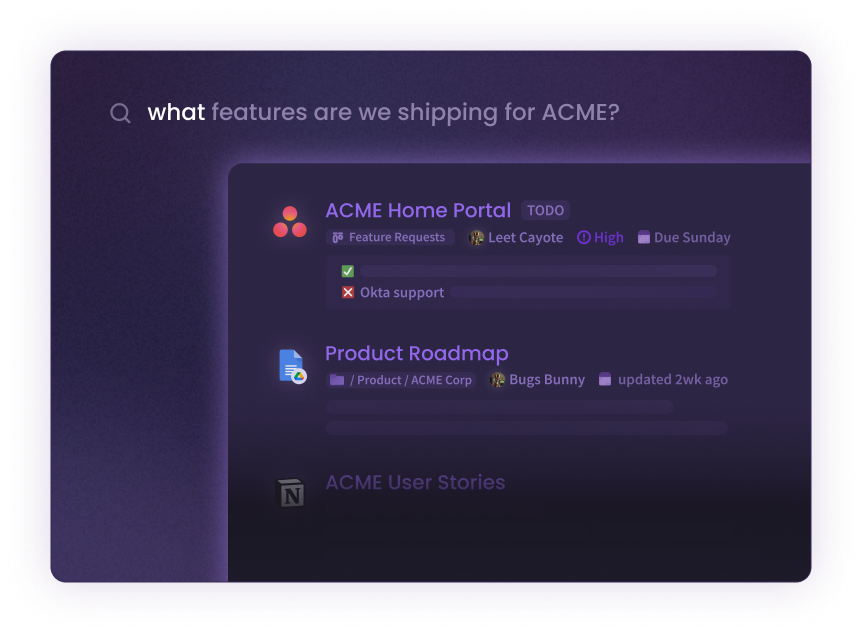
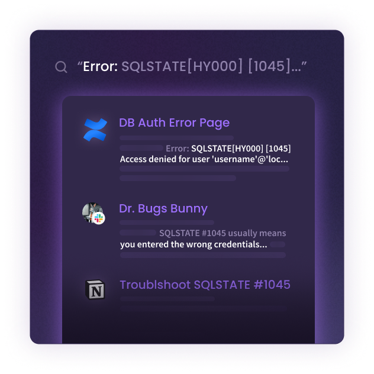
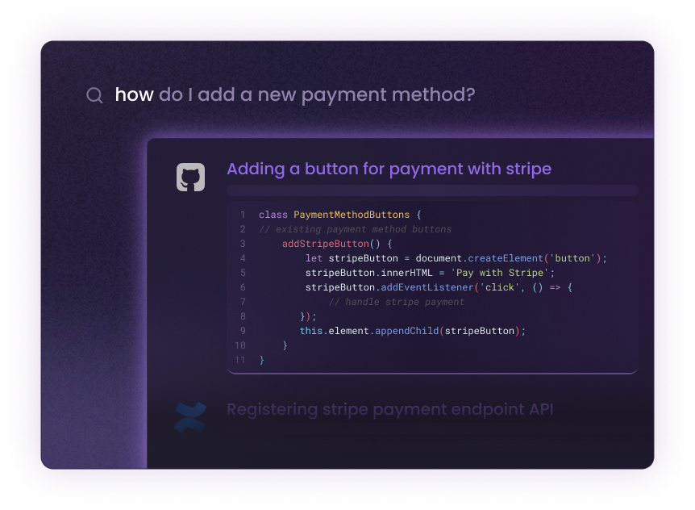

Find any conversation, doc, or internal page in seconds  ⏲️⚡️  
**Join 100+** devs by hosting your own gerev instance, become a **hero** within your org! 💪

## Join Discord for early access code!

  

   [Join here!](https://discord.gg/zZZrUBZd)
# Search focused on devs
Devs are the best early adopters, they adopt technology early and aid in spreading it to their non-technical peers. That's why gerev is focused on making a product dev's adore and love    ❤️

## Made for devs 👨‍💻
-  **For finding internal pages _fast_ ⚡️**


- **Troubleshoot Issues 🐛**

- **For finding code snippets and code examples 🧑‍💻**  
Coming Soon...


## Integrations
 - [x] Slack
 - [x] Confluence
 - [x] Google Drive (Docs, .docx, .pptx)
 - [x] Bookstack
 - [ ] RocketChat (in PR)
 - [ ] Gitlab Issues (In PR)
 - [ ] Notion (In Progress...)
 - [ ] Microsoft Teams
 - [ ] Sharepoint
 

## Natural Langauge
Enables searching using natural language. such as `"How to do X"`, `"how to connect to Y"`, `"Do we support Z"`

---  

# Getting Started
1. Install *Nvidia for docker* 
2. Run docker
 
## Nvidia for docker
Install nvidia container toolkit on the host machine.

```
distribution=$(. /etc/os-release;echo $ID$VERSION_ID) \
   && curl -s -L https://nvidia.github.io/nvidia-docker/gpgkey | sudo apt-key add - \
   && curl -s -L https://nvidia.github.io/nvidia-docker/$distribution/nvidia-docker.list | sudo tee /etc/apt/sources.list.d/nvidia-docker.list
   
sudo apt-get update

sudo apt-get install -y nvidia-docker2

sudo systemctl restart docker
```


## Run docker
Then run the docker container like so:

### Nvidia hardware
```bash
docker run --gpus all -p 80:80 -v ~/.gerev/storage:/opt/storage gerev/gerev
```

### CPU only (no GPU)
```
sudo docker run -p 80:80 -v ~/.gerev/storage:/opt/storage gerev/gerev
```

## Run from source 
Run the backend:
```bash
cd app
pip install -r requirements.txt
uvicorn main:app
```

Run the UI:
```bash
npm install
npm start
```
---
- **gerev is also popular with some big names. 😉**  


