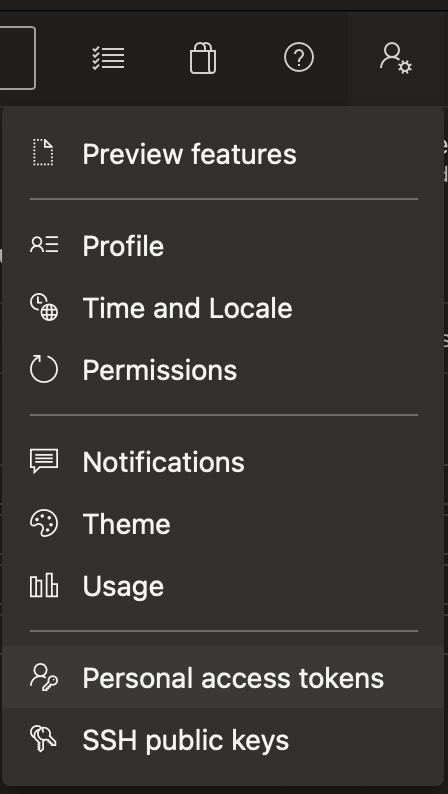
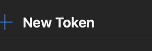
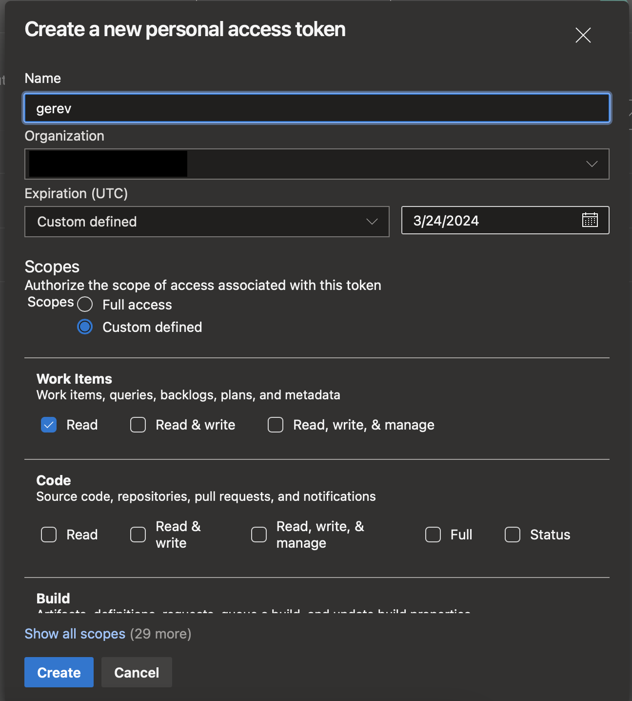
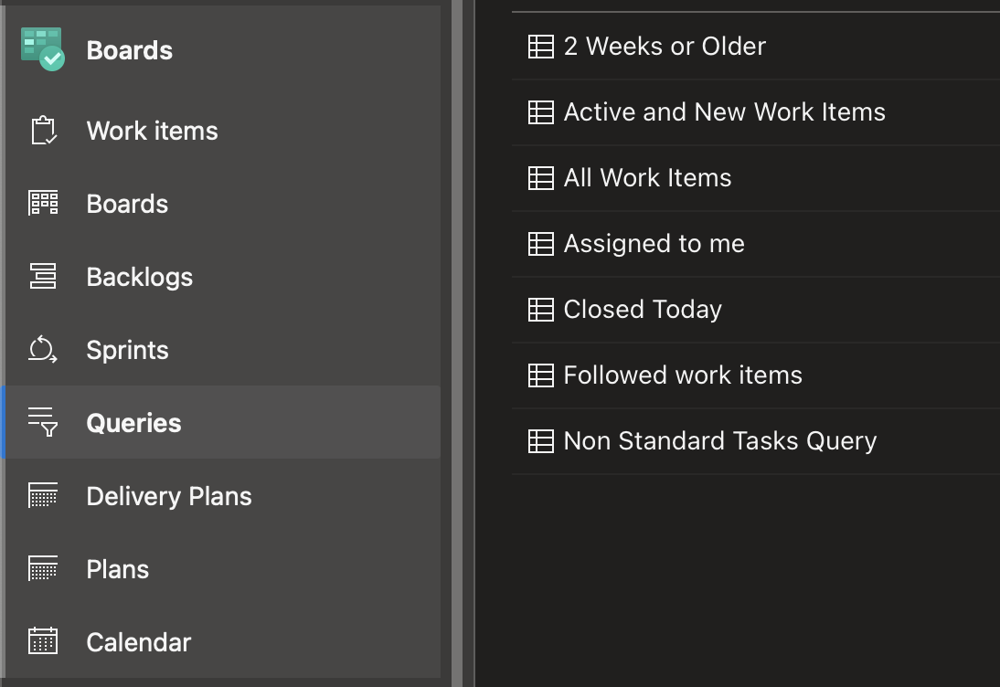
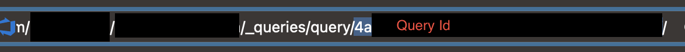
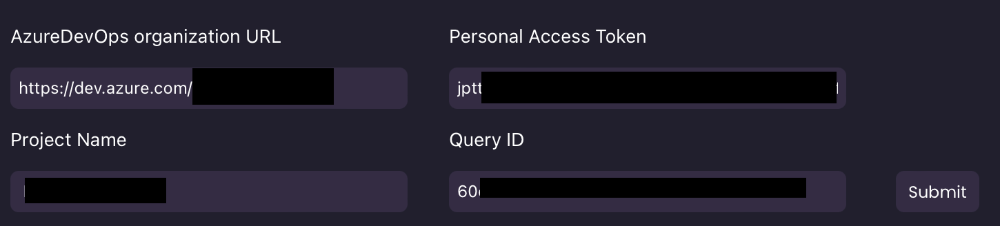

# Setting up Azure DevOps Data Source
Please note this will only index Work Items returned by your Query

1. Navigate to the settings menu in the top-right hand corner of the screen and select Personal Access Tokens.

2. Click on the new option.

1. Complete the form, and set the expiration date to custom. Select the furthest expiration date possible. Make sure to only provide read only permissions.

1. Hit Create and copy the token from the next window.
2. Navigate to your Project and go to Boards > Queries. Select your query from the list.

1. Copy the Query ID from the URL in the address bar.

1. Go to Gerev and input all of the data into the fields.
