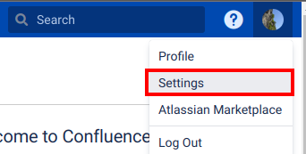
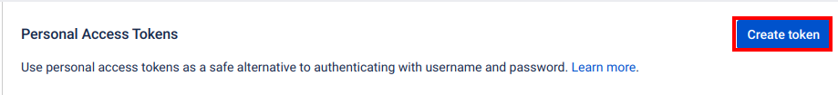
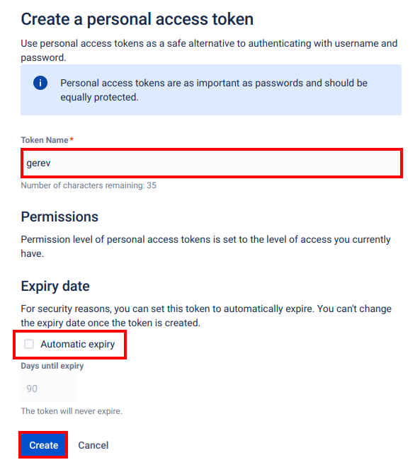

# Setting up Confluence data source

Please note that all pages you have read access to, in all spaces, will be indexed.

1. Click on your profile picture and go to **Settings**

2. Go to **Personal Access Tokens**

3. On the right, click **Create Token**

4. Give the token a **name** and **uncheck automatic expiry**

5. **Copy the generated token** into the Gerev settings page, together with the **Confluence URL**

