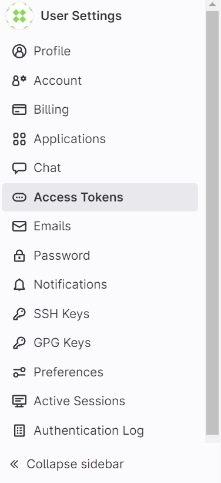
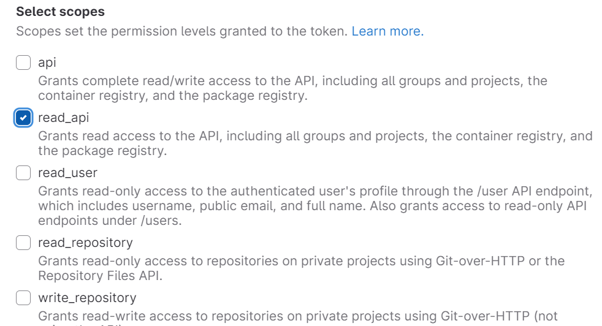

# Setting up Gitlab data source

Please note that all projects you have member access to, will be indexed.

1. Click on your profile picture and go to **Preferences**

2. Go to **Access Tokens**

3. Add the token name, remove the expiration date and check the read api checkbox

5. **Copy the generated token** into the Gerev settings page