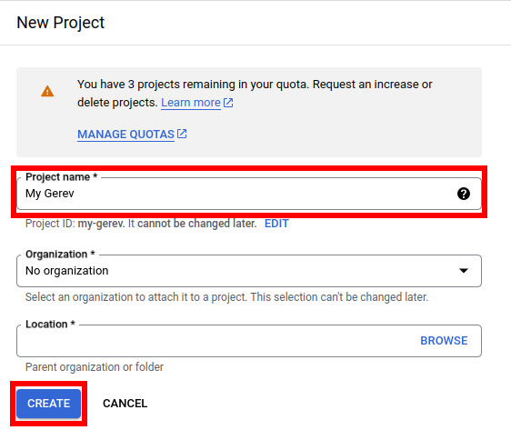
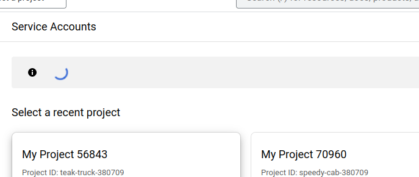

# Google drive

## Setting up

The process involves creating a service account with an email address, then sharing drive folders with that service account.

1. Go to [Create a project](https://console.cloud.google.com/projectcreate?previousPage=%2Fprojectselector2%2Fiam-admin%2Fserviceaccounts%2Fcreate) on google cloud console. Choose a name and organization (you can also leave organization empty)

2. Wait for loading to finish, you should be redirected to the 'create a service account' page. 

3. Select a name for the account. The rest of the fields don't matter, you can press done at the bottom.

4. hover over the newly created service account and copy the email address and save it.

5. click the newly created service account, then go to the KEYS tab

6. click ADD KEY -> Create new key and Select JSON. It should download a json file.

7. Go to [Google Drive](https://drive.google.com/) and share the google drive folders you want to index with the service account email

7. copy the contents of the json file into the box in the Gerev settings panel