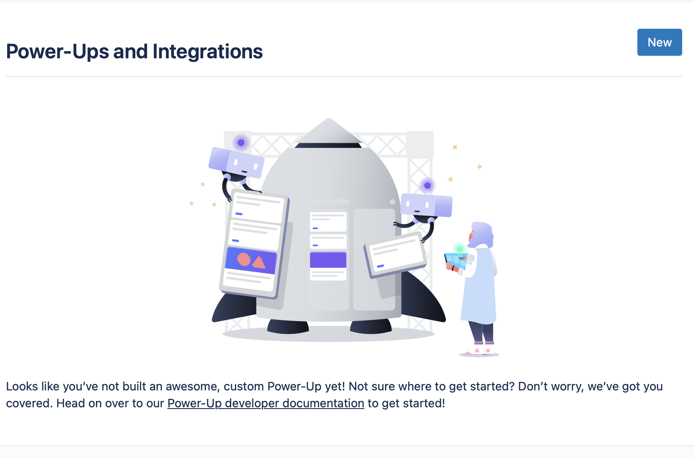
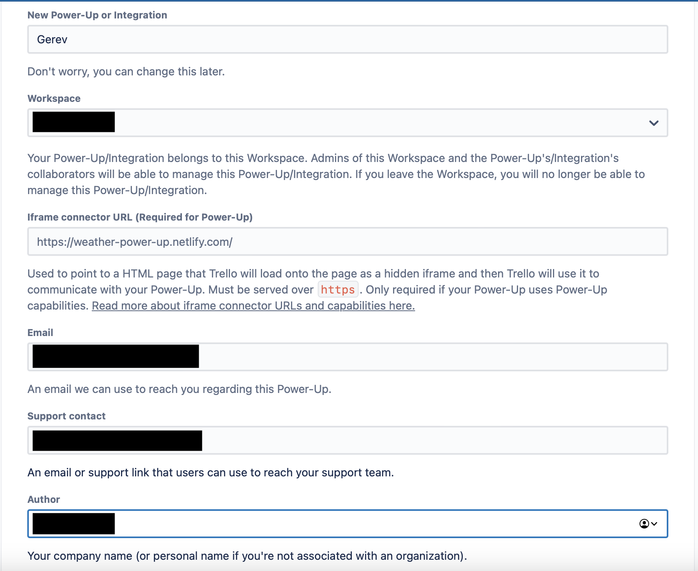
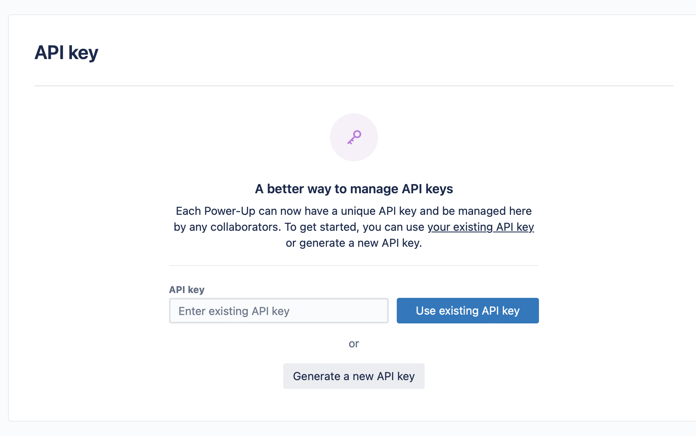
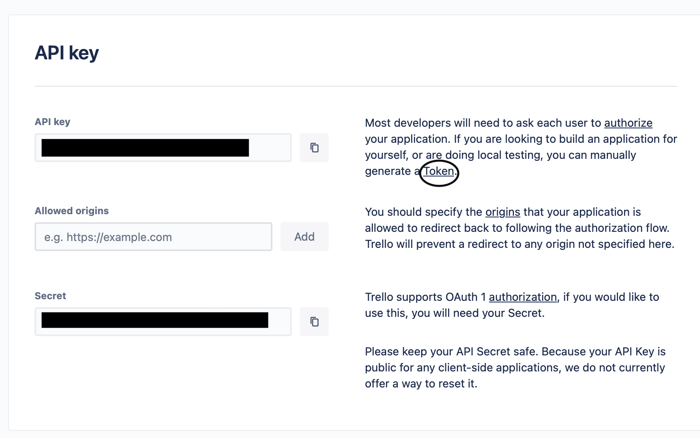

# Setting up Trello data source

Please note that all cards on all boards you have access to will be indexed.
1. Navigate to the [Trello Docs](https://developer.atlassian.com/cloud/trello/guides/rest-api/api-introduction/) and navigate to the Power Ups page.
2. Once on the Power-Ups page click the new button.

3. Fill out the form on the page, and save your Power-Up.

4. On the next page click the "Generate a new API key" option.

5. Copy the API Key and paste it into Gerev.
6. Click on the "Token" link, and authorize the app on the next page.

7. Copy the token that appears on the next page and paste it into the API Token field.
8. Specify your Organization name and save the data source.